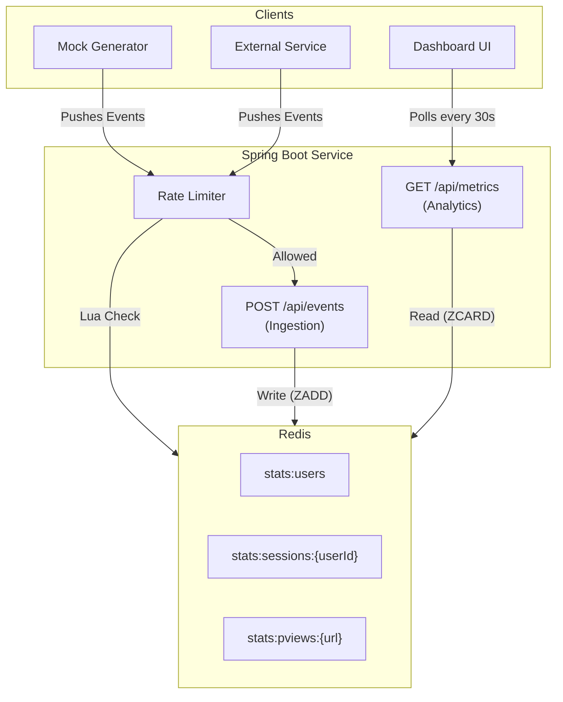

## Analytics Service

Spring Boot service that ingests JSON events, stores metrics in Redis sorted sets, and serves a lightweight dashboard.

### Features
- POST `/api/v1/events` ingests validated events with rate limiting and logs any rate-limited requests.
- Rolling metrics from Redis: active users (5m), page views by URL (15m), active sessions per user (5m). Data survives app restarts.
- Dashboard at `/` auto-refreshes every 30s.
- Mock event generator CLI to push load.
- Dockerfile and docker-compose for one-command startup.

### Prerequisites
- Java 17+
- Maven 3.9+
- Redis 7+ (primary metrics store and rate limiting)
- Docker (for containerized run)

### Run with Docker Compose
```bash
docker compose up --build
# app available at http://localhost:8080
# redis exposed on localhost:6379 with AOF persistence
```

### Run locally
```bash
# run service module (hot reload): 
mvn -pl service -am spring-boot:run
# optionally point at a running redis:
# SPRING_DATA_REDIS_HOST=localhost SPRING_DATA_REDIS_PORT=6379 mvn -pl service -am spring-boot:run
# open http://localhost:8080
```

### API
- `POST /api/v1/events`
  - Body:
    ```json
    {
      "timestamp": "2024-03-15T14:30:00Z",
      "user_id": "usr_789",
      "event_type": "page_view",
      "page_url": "/products/electronics",
      "session_id": "sess_456"
    }
    ```
  - Metrics handling: only `event_type` of `page_view` is counted toward active users, active sessions, and page views. Other event types are accepted but ignored for these metrics.
  - Rate limited (default ~200 req/min per client IP). Returns `202 Accepted`.
- `GET /api/v1/metrics/active-users` → `{ "count": 12, "windowSeconds": 300 }`
- `GET /api/v1/metrics/page-views` → top 5 pages from the last 15 minutes.
- `GET /api/v1/metrics/active-sessions` → active session counts per user (5 minutes).
- `GET /api/v1/metrics/summary` → combined payload used by the dashboard.

### Dashboard
- Served from `src/main/resources/static/index.html`.
- Shows active users, top pages, and active sessions per user.
- Includes a small form to send a test event directly.

### Mock Data Generator (separate module)
- Path: `mock-generator/`
- Build:
```bash
cd mock-generator
mvn -q -DskipTests package
```
- Run:
```bash
java -jar target/mock-generator-0.0.1-SNAPSHOT-jar-with-dependencies.jar http://localhost:8080/api/v1/events 100
# args: <endpoint> <interval_ms> (defaults: http://localhost:8080/api/v1/events, 200ms)
```
- Docker helper (after building the generator jar from within `mock-generator`):
```bash
docker build -f ../mock-generator.Dockerfile -t mock-generator ..
docker run --rm --network=host mock-generator
```

### Testing
```bash
mvn test          # runs all modules
# or just the service:
mvn -pl service test
```

### Architecture Overview


### Project Structure
- Parent POM (`pom.xml`) aggregates:
  - `service/` main Spring Boot service
    - `controller/` REST endpoints and error handling
    - `service/` ingestion, validation, metrics, rate limiting
    - `processor/` event-to-Redis writer (stateless)
    - `repository/` Redis ZSET-backed metrics access
    - `model/` core domain objects and metric projections
    - `config/` rate limit configuration/filter, Redis clock bean
  - `mock-generator/` standalone event load generator

### Configuration
- Redis: `SPRING_DATA_REDIS_HOST` (default `localhost`), `SPRING_DATA_REDIS_PORT` (default `6379`), `spring.data.redis.timeout` (default `2s`).
- Rate limiting (token bucket): `analytics.rate-limit.capacity` (default 200 burst tokens), `analytics.rate-limit.refill-per-second` (default 3.33 tokens/sec ≈ 200 tokens/min).
- Service port: `server.port` (default 8080).

### Assumptions & Tradeoffs
- Metrics are derived exclusively from events where `event_type == "page_view"`. All other event types are ignored.
- Used non-blocking `SCAN` command instead of blocking `KEYS` command, to safely fetch metrics without freezing the server.
- If Redis becomes unavailable, the system serves the last known data from local memory. We prioritize keeping the dashboard visible (Availability) over strict freshness (Consistency) during outages.
- If Redis is unavailable, the rate limiter rejects requests (Fail-Closed) rather than allowing unrestricted traffic (Fail-Open).
### Future Improvements
1) Persist raw events to Kafka/S3 for replay and offline analytics.  
2) Add Grafana/Prometheus metrics and health check for operations.  
3) Implement a 'retry queue' to capture and process rate-limited events later.  
4) Add integration test and load test.
5) Enforce rate limiting at the API gateway/load balancer to remove the single point of failure in the application layer and improve performance.
